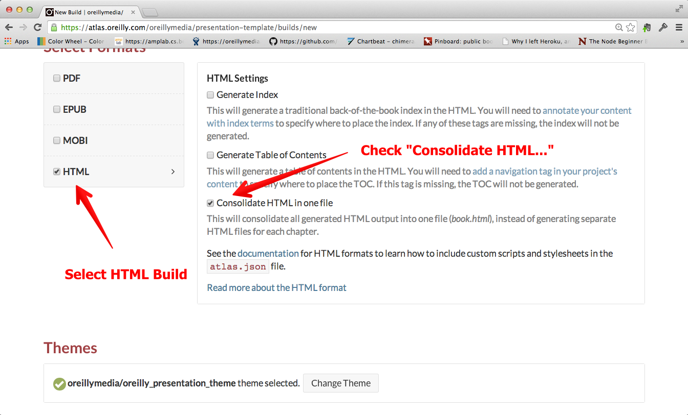

# Atlas presentation template

This is a template for a presentation in Atlas. (Or, what we're calling an "Atlascast".)  It provides the basic instructions you need to follow to make a new presentation in Atlas.

## Installing the template into Atlas

In this pre-release version of Atlas, the first step in using the template is to get a fresh copy of it into your GitHub account.  To do this, you'll need to clone the repository to your local machine, like this:

```
$ git clone --shallow https://github.com/oreillymedia/presentation-template.git
````

(Be sure to use the "--shallow" option so that you don't get the version history.)  Once you download the template, you should create a new project on GitHub, and then add a remote on your local machine to your new presentation.  For example:

```
$ cd presentation-template
$ git remote add github git@github.com:aliginedleft/scatteredtoscatterplot.git
$ git push gihub master
```

Once you've pushed the new repo up, you can open it in Atlas.

## Working in Atlas

Every "slide" in Atlas must be wrapped in a "chapter" section.  You can organize your slides by putting each one in it's own file, or putting multipl "chapter" sections together in a single file.  Each slide can can contain any kind of content, such as:

* plain text
* lists
* tables
* hyperlinks
* images
 
You can also use the "Insert Media" button to insert the HTML markup for:
* YouTube or Vimeo videos
* JSBins
* Google form widgets (these are a simple way to have an interactive poll or form for your viewers)
* Arbitratray iframes

The "sample.html" file provides some ideas to try.

## Create a title page

To create a title page, edit the "titlepage.html" file.  This file will automatically be placed at the start of your presentation.

## Creating an index page

Edit the file "index.html" to create a landing page that describes the presentation.  Unlike the other slides in this file, there are no default styles or layont applied to this file, so you can pretty much design it how you like.  We recommend you include:

* A description of the presentation
* A brief bio and photograph
* A brief list of topics covered in the talk

## Build the presentation

You build an Atlas presentation just like you build a book:

* Use the theme named "oreillymedia/oreilly\_presentation\_theme"
* Select In the HTML Build options, select the "Consolidate HTML in one File" option, like this:



* Drag the files that contain your slides into the build
* You can also build a pretty passable PDF to hand out after the fact.  
 

## Viewing the site on your local machine

Once you build the file, download and unzip it.  If you're on a Mac, you can drop into a terminal and go to the directory where you unzipped it and run this:

```
python -m SimpleHTTPServer
```

If you're on a Windows machine, perhaps you'll be kind enough to submit a pull request that explains the best way to do this on Windows.

## Publishing the site

You can pubslih the HTML anywhere where you can host a static site.  O'Reilly will work with you if you want to piublish it on an ORM domain.

